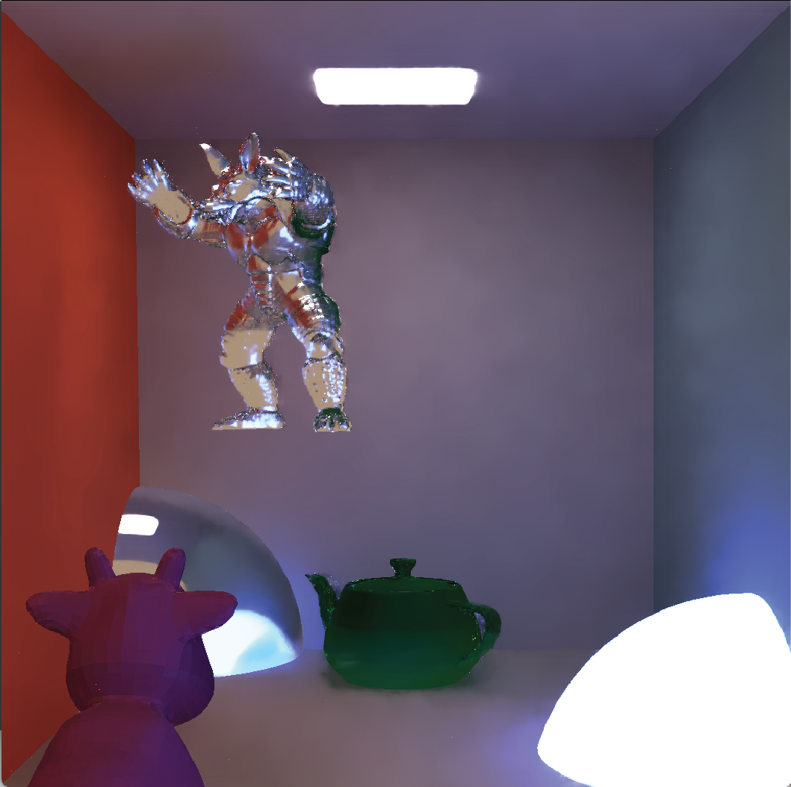

I am a master's student at Utrecht University in the Netherlands. My research interests include computer graphics, rendering, and geometry processing.

Currently, I'm working as a software engineer and research intern in geometry processing at [Braid](https://www.linkedin.com/company/braid-technologies/) in Tokyo. I will also be working on geometry processing research as part of an [MIT Fellowship](https://sgi.mit.edu/) in Summer 2025.

I am looking for **full-time opportunities to start in Fall 2025**. If you see a potential fit, please [let me know!](mailto:evakato14@gmail.com)

 
 

## Projects

<table style="width:100%">
  <tr>
    <td style="width:33%">
      
    </td>
    <td style="width:33%">
    </td>
    <td style="width:33%">
    </td>
  </tr>

</table>

