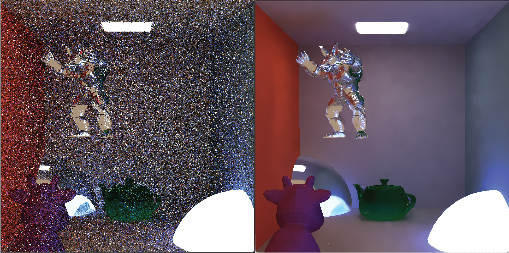
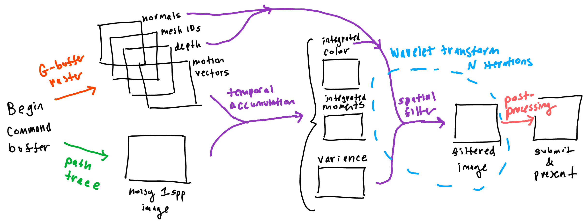
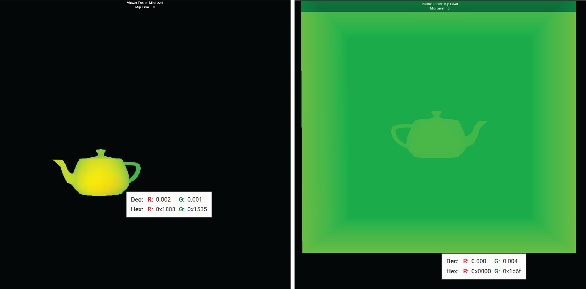
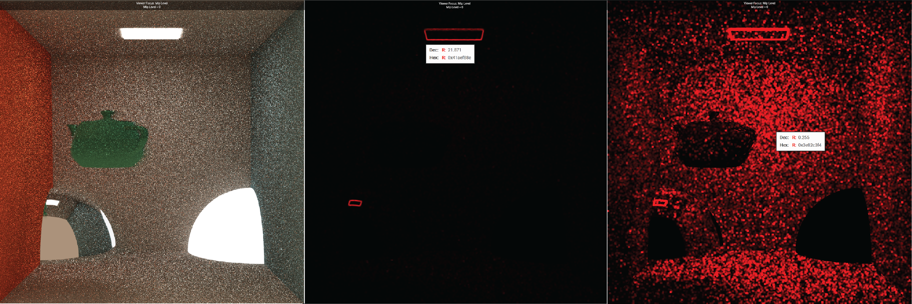
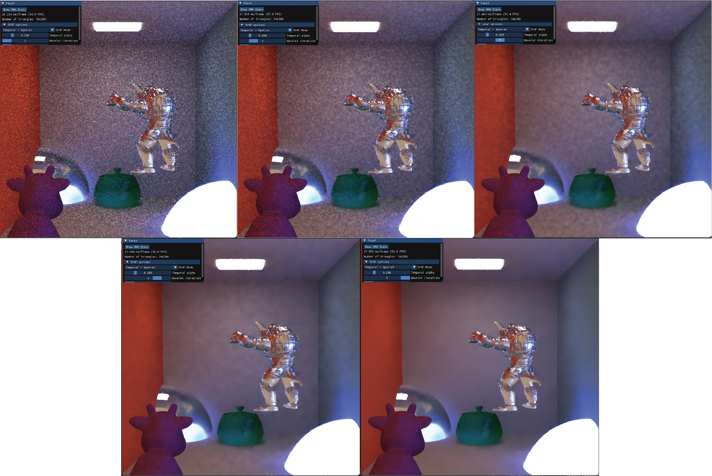
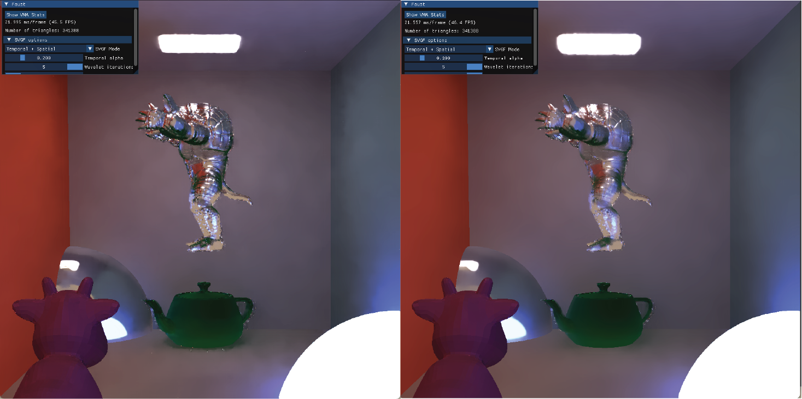

# Faust

A Vulkan path tracer with spatiotemporal variance-guided filtering

  

`faust` is a minimal Vulkan path tracer fitted with a denoising pipeline to improve real-time rendering quality. The implementation is based on Schied et al.'s 2017 paper ["Spatiotemporal Variance-Guided Filtering: Real-Time Reconstruction for Path-Traced Global Illumination."](https://research.nvidia.com/publication/2017-07_spatiotemporal-variance-guided-filtering-real-time-reconstruction-path-traced)

I built everything atop a bare path tracer by [yknishidate](https://github.com/yknishidate/single-file-vulkan-pathtracing). For the path tracing input into the filter, I tried to stay as faithful to the original implementation as possible; i.e. this is a completely raw path tracer, whereas the SVGF paper uses next event estimation, separated direct and indirect illumination, among other techniques. All my results use **4 samples per pixel** and 32 maximum bounces per path.

## Overview

In conjunction with the ray tracing pass, implementing SVGF requires a rasterization pass (akin to [deferred rendering](https://en.wikipedia.org/wiki/Deferred_shading)). Using these two passes as inputs, we can use historical samples of our scene with a _temporal_ filter, and then smoothen things out with a _spatial_ filter. Both filters can be implemented in Vulkan with compute shaders. Importantly, the temporal filter can also be used to estimate variance of a sample. The image written by the spatial filter is then submitted for presentation to the swapchain.

<figure align="center">
  
  <figcaption>Overall pipeline for my Vulkan implementation.</figcaption>
</figure>

## Temporal filtering

The idea behind temporal filtering is that previous frames in time can potentially contribute to the current frame's image, even if there is object or camera movement. This is where the rasterization pass kicks in, because

1. We need to map pixels in the current frame to pixels in the previous frame
2. We want to check the accuracy of our map (i.e. check if the current pixel is a disocclusion).

For the purposes of 1. it suffices to write an attachment that captures "screen-space motion." A _motion vector_ is defined per pixel, the 2D vector describing how the corresponding point has moved in screen space from the previous frame to the current frame. There are two sources of motion in my scenes: camera transforms and object transforms. For object transforms, I used Vulkan's push constants to send the current frame's model matrix and previous frame's model matrix to the vertex shader, per instance:

    struct gbufferPushConstants {
      mat4 model;
      mat4 prevModel;
    }

For camera motion, I used a uniform buffer to send the camera transformation data to the fragment shader:

    struct cameraUBO {
      mat4 view;
      mat4 projection;
      mat4 prevView;
      mat4 prevProjection;
    }

This is an example of what the produced attachment would look like, where uv motion vectors are written to red and green channels:

<figure align="center">
  
  <figcaption>Left: teapot translating down and to the right + static camera. Right: static teapot + camera moving upwards. The colors are normalized in each photo. </figcaption>
</figure>

As I alluded to in 2., it is possible that the current point was a disocclusion in the prior frame, and we don't want to be informed by history if the two points don't match. The paper suggests comparing depths, normals, and mesh ids of the prior frame; if the point at the current frame doesn't match with the prior frame, we throw away history and use the raw sample of the current point. To make it so I can always access the current and previous frame data, I created two sets of framebuffers that the G-buffer pass can write to. Based on the index of the current frame (check for odd/even), we can switch between the currently used framebuffer and the previous framebuffer that we compare against (see: [ping ponging](https://wwwold.mathematik.tu-dortmund.de/papers/Goeddeke2005b.pdf)).

Within a compute shader, I used a 2x2 tap [bilinear filter](https://en.wikipedia.org/wiki/Bilinear_interpolation) to compare geometries. The paper also suggests falling back on a 3x3 tap filter if the 2x2 filter fails, but I omitted this step. If the current point does successfully match with the previous frame's point, the paper combines the two colors linearly using a factor of $\alpha$. They default $\alpha = 0.2$, but for fun I exposed this parameter to the user by using a push constant:

<figure style="margin-inline: 0; padding-inline: 0; text-align: center;">
  
  <figcaption>Teapot orbiting leftward in screenspace. From left to right: $\alpha$ values 0.01, 0.1, 0.2, 0.4 </figcaption>
</figure>

We can see lower $\alpha$ values yield smoother results but cause some crazy ghosting when objects move, like the smeared teapot on the left. Higher $\alpha$ values better track motion but are more noisy.

## Spatial filtering... guided by variance!

The key idea in this paper is that spatial filtering should be informed by the amount of variance a pixel has; i.e. higher-variance regions should require more filtering than lower-variance regions. How can we estimate variance? We're already looking at temporal data, and it can also inform our judgment of the variance a pixel has.

Specifically, they propose that estimating temporal variance from the first and second integrated moments of color luminance. Thus, similarly to integrated color, we can create another Vulkan image for integrated moments to write to every frame (red channel for the first moments, green channel for the second moments). Since variance will also be updated by the wavelet filter, I created a separate resource for that, but the preliminary variance calculation from the temporal filter is straightforward once the moments are set up: $\sigma_i^2 = \mu_{2,i} - \left( \mu_{1,i} \right)^2$ where $\mu_{n,i}$ is the $n$th integrated moment at pixel $i$ (unless the pixel represents a recent disocclusion, in which case the variance estimate computation is more involved, see Section 4.2).

An example output of variance estimation is shown below, written to the red channel. I included a specular object in the scene for more variety.

<figure align="center">
  
  <figcaption>Temporal filtered example scene (left), normalized estimated temporal variance estimation (middle), unnormalized estimated variance (right)</figcaption>
</figure>

The region around the ceiling light has the most variance, likely because indirect light paths from the emitter are hard to sample consistently, leading to unstable radiance estimates.

## Putting everything together: the wavelet transform

A traditional [bilateral filter](https://en.wikipedia.org/wiki/Bilateral_filter) has fixed weights and has no awareness of signal reliability. In SVGF's spatial filter, the luminance edge-stopping function is _adaptive_ as it uses the precomputed variance to re-normalize luminance in a region. They also employ an _a-trous wavelet transform_ which samples more sparsely, which is a more efficient option for multi-pass denoising.

The spatial filter consists of several iterations, inputing and outputing both filtered color and variation. Here I made use of ping-ponging again to read data from the previous iteration and overwrite new data to Vulkan images. I set up two descriptor sets to represent the two ping-ponged states, and at runtime, I bind the corresponding descriptor set and dispatch the pipeline.

The paper used five wavelet iterations, likely because this had the best balance of spatial bias and resource allocations. The more the wavelet filter is applied, we can guess that the more smooth and less noisy the image looks, with a bit a of a sacrifice on the overall sharpness. Here's what my renderer outputted for each iteration ($i = 1$ to $i=5$):

<figure align="center">
  
  <figcaption>Wavelet transform over 5 iterations; from left to right: (top row) $i = 1$, $i=2$, $i=3$ and (bottom row) $i=4$, $i=5$</figcaption>
</figure>

Another thing I experimented with was the **color history input** for temporal accumulation. The paper empirically used the output from the first wavelet iteration as their color history for the next frames, but I was interested in the effects of using higher iterations:

<figure align="center">
  
  <figcaption>Left: color history input using wavelet iteration $i=1$. Right: color history input using wavelet iteration $i=5$</figcaption>
</figure>

Unsurprisingly, the higher iteration ($i = 5$) reduces noise more aggressively, like on the walls and armadillo. This comes at the cost of oversmoothing fine details and lost sharpness.

## Performance

My final scene features an orbiting armadillo, spinning teapot, specular sphere, moving light, and in total, 341388 triangles. An FPS comparison from this scene of full SVGF, solely temporal filtering, and raw ray tracing is below. FPS varied across frames due to movement in the scene.

| Configuration              | Average FPS | FPS Range |
| -------------------------- | ----------- | --------- |
| Full SVGF (default params) | ~70         | 66 – 78   |
| Temporal filter only       | ~88         | 83 – 92   |
| Raw ray tracing only       | ~102        | 94 – 110  |

For allocating memory for Vulkan buffers and images, I used [VMA](https://github.com/GPUOpen-LibrariesAndSDKs/VulkanMemoryAllocator). Conveniently, you can easily grab memory statistics with their library:

| Metric                | Value            |
| --------------------- | ---------------- |
| Block Count           | 19               |
| Allocation Count      | 55               |
| Total Block Bytes     | 228.00 MB        |
| Total Allocated Bytes | 190.87 MB        |
| Unused Range Count    | 6                |
| Smallest Allocation   | 256 bytes        |
| Largest Allocation    | 16,777,216 bytes |
| Smallest Free Range   | 128 bytes        |
| Largest Free Range    | 23,133,184 bytes |

Overall, my renderer achieves real-time performance even with full SVGF enabled! With the help of VMA, memory management was handled cleanly, with efficient allocation across 19 memory blocks. Considering 228 MB total block memory and 190.87 MB actively used (37.13 MB unused), the largest contiguous block being 22.06 MB is a good sign of minimal fragmentation.

[back](./../)
