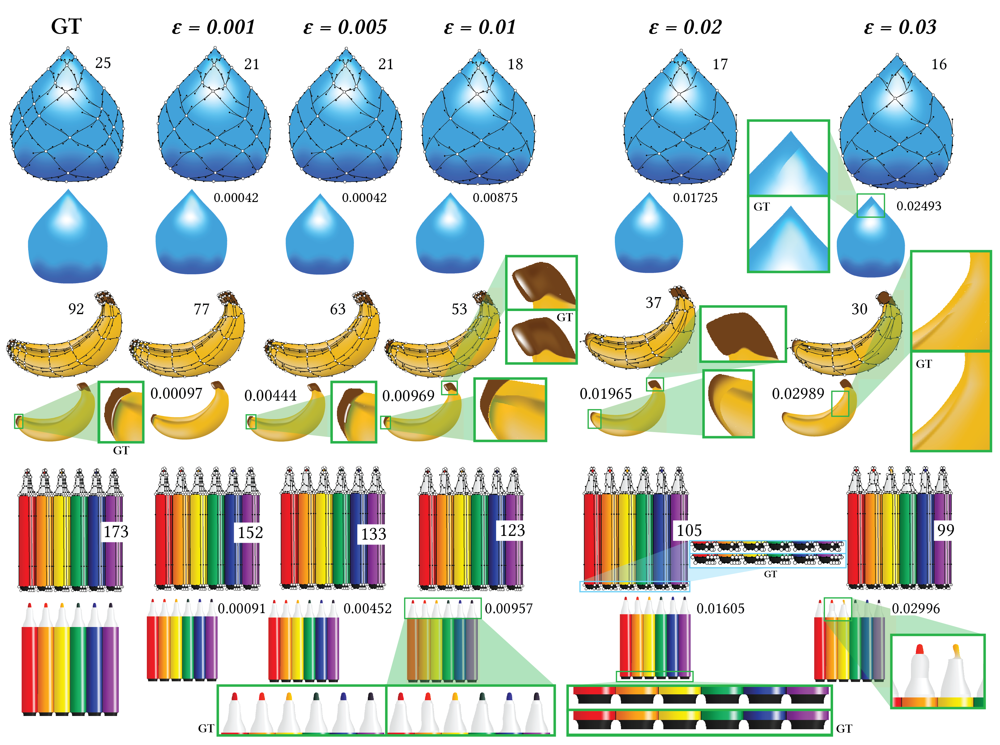
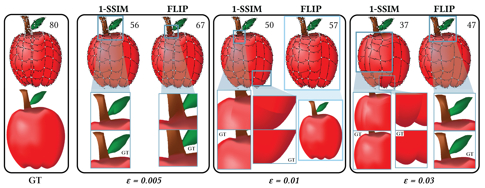
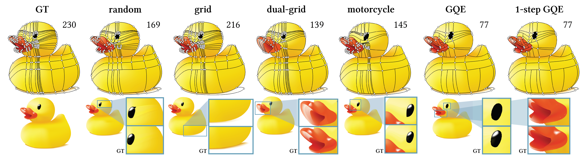

# Gradient mesh simplification

This is a quick overview of my master's thesis work at Utrecht University. Code can be viewed [here](https://github.com/evakato/gradmesh-simplification).

Gradient meshes are powerful vector graphic primitives known for their complex color propagation, but their fixed rectangular topology poses limitations. They are modeled by cubic surfaces and rely on _global refinement_, which can introduce unnecessary detail and complicate the artist’s workflow. We propose a method for simplifying traditional gradient meshes through _local coarsening_---iteratively merging adjacent faces and eliminating redundant data, all while preserving visual quality.

We offer artists control over the simplification process by introducing an error threshold, allowing them to balance the level of simplification with visual fidelity.

To evaluate visual quality, we use established image distance metrics in our error function: 1-SSIM and FLIP.

We also propose several heuristics for simplification algorithms, each having some trade-off between simplification quality and speed.

